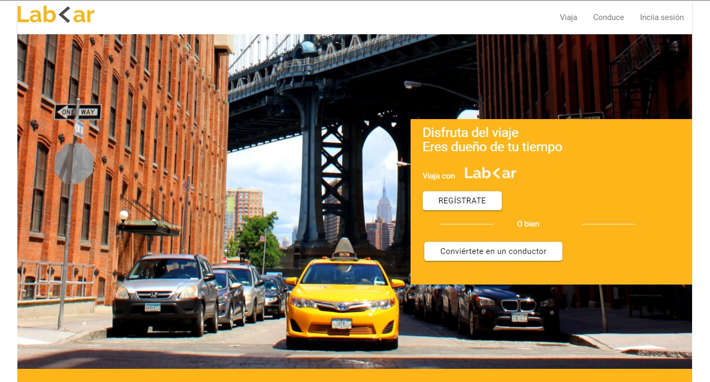
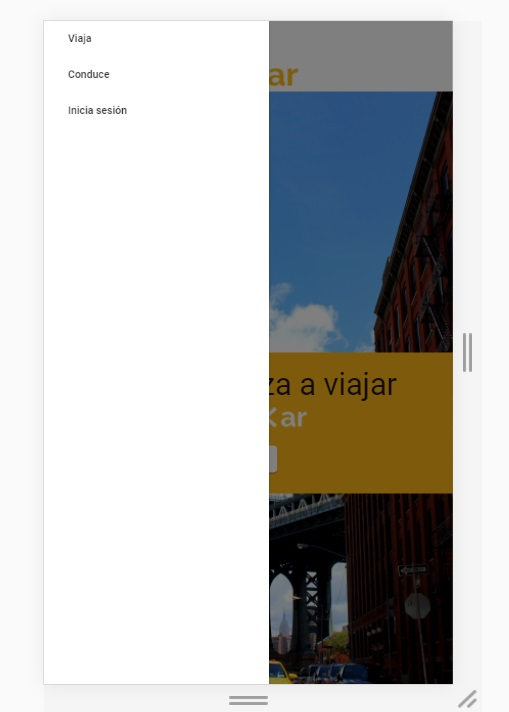

# Proyecto: Lab Car

## Descripción del Proyecto.

El siguiente proyecto es la maquetación de la página web de LabCar, a través del desarrollo de un layout responsive para que sea adaptable a todo tipo de pantallas.
Se ha implementado mediante la utilización de Materialize, siguiendo su sistema de grillas.

## Partes de la página web

1. Un header con un navbar con tres botones. Se convierte en un menú hamburguesa en dispositivos móbiles.

2. Una sección con un hero con la imagen principal. El contenido varía de acuerdo a los dispositivos. En mobile solo hay un botón de "Descargar la app", en dispositivos más grandes, hay dos botones: el de "Registro" y el de "Convertirse en conductor"

3. Una sección descriptiva sobre la nueva aplicación. 

4. Un sección con un botón de "Conviértete en conductor"

5. Una sección sobre como calcular la ruta y las tarifas.

6. Un footer navegable. Las opciones de navegación aumentan en los dispositivos grandes

## Herramientas utilizadas.

1. HTML5

2. CSS3

3. Materialize

4. jQuery